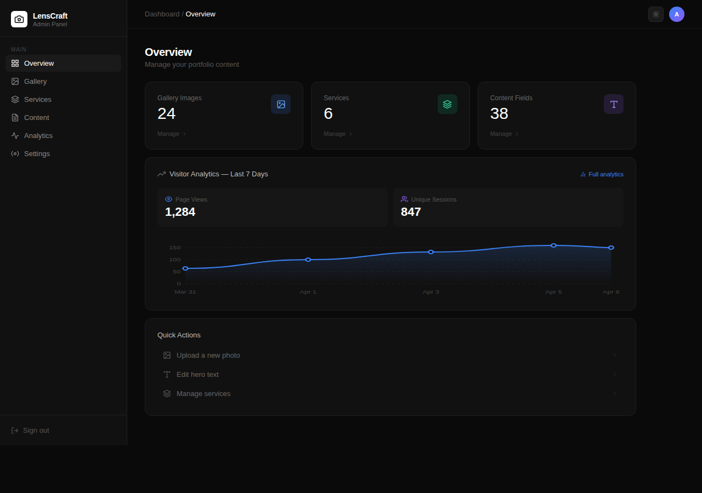

# LensCraft Photography Portfolio

A modern, full-stack photography portfolio built with **Next.js**, **TypeScript**, and **Tailwind CSS**. Features a public-facing portfolio site with luxurious animations and a fully-featured admin CMS for managing gallery images, services, and all site content — backed by a PostgreSQL database, Vercel Blob storage, and JWT-secured authentication..


## 🖥️ Screenshots

### Portfolio Site


### Admin Dashboard



## 🆕 Latest Updates

- **Hero Performance** — Simplified Hero section image structure: the background `<Image>` and overlay `<div>` are now direct siblings inside a single `motion.div`, removing an unnecessary DOM wrapper and improving first-paint performance.

## ✨ Features

### Portfolio Site
- **Luxurious Animations** - Smooth entrance and transition effects powered by Framer Motion
- **Optimised Hero Section** - Background image and dark overlay rendered as direct siblings inside a single animated wrapper for faster first-paint
- **Responsive Design** - Fully mobile and desktop friendly
- **Dark/Light Mode** - System preference detection with manual toggle
- **Dynamic Gallery** - Masonry grid populated from the database with category filtering, hover effects, skeleton loading states, and a zoomable image lightbox
- **Services Section** - Animated service cards managed via the admin CMS
- **Contact Form** - Email delivery via Gmail SMTP (Nodemailer) with form validation and submission feedback
- **About Section** - Photographer bio with editable statistics
- **Custom Favicon** - Modern camera-aperture icon displayed in browser tabs and bookmarks; fully replaceable from the admin dashboard without redeploying

### Admin CMS (`/admin`)
- **JWT Authentication** - Secure login with httpOnly session cookies and middleware-enforced route protection
- **Gallery Manager** - Upload photos to Vercel Blob, edit alt text and category, mark images as featured, delete images; supports drag-and-drop uploads
- **Content Editor** - Edit all portfolio text (hero, gallery, about, contact, site settings) section by section without touching code
- **Services Manager** - Add, edit, reorder, and delete services shown on the portfolio
- **Overview Dashboard** - At-a-glance stats for gallery images, services, and content fields with quick-action links
- **Analytics** - 7-day visitor stats with page views, unique sessions, device types, and a sparkline trend chart
- **Favicon Manager** - Upload a custom PNG/WebP favicon from the Settings page; changes take effect site-wide within minutes with no redeployment required; reset to the default camera-aperture icon at any time

## 🖼️ Sections

- **Hero** - Full-screen intro with editable tagline, title, and CTA buttons
- **Gallery** - Database-driven masonry grid with image hover effects
- **Services** - Animated service cards sourced from the database
- **About** - Photographer bio with editable statistics
- **Contact** - Contact form (powered by Gmail SMTP / Nodemailer) with info cards
- **Footer** - Social links and branding

## 🚀 Getting Started

### Prerequisites

- Node.js 18+
- npm or yarn
- A [Neon](https://neon.tech) or Vercel Postgres database
- A [Vercel Blob](https://vercel.com/docs/storage/vercel-blob) store (for image uploads)
- A Gmail account with an [App Password](https://support.google.com/accounts/answer/185833) enabled (for the contact form)

### Installation

```bash
# Clone the repository
git clone https://github.com/mrglasswillbreak/photographyPortfolio.git

# Navigate to project
cd photographyPortfolio

# Install dependencies
npm install

# Copy the example env file and fill in your values
cp .env.example .env.local

# Start development server
npm run dev
```

### Environment Variables

Copy `.env.example` to `.env.local` and set the following:

| Variable | Description |
|----------|-------------|
| `ADMIN_USERNAME` | Admin login username |
| `ADMIN_PASSWORD` | Admin login password |
| `JWT_SECRET` | Secret used to sign session tokens (`openssl rand -base64 32`) |
| `DATABASE_URL` or `POSTGRES_URL` | Neon / Vercel Postgres connection string (`POSTGRES_URL` is also supported for legacy or auto-populated Vercel Postgres envs) |
| `BLOB_READ_WRITE_TOKEN` | Vercel Blob read/write token |
| `GMAIL_USER` | Gmail address used to send contact form emails |
| `GMAIL_APP_PASSWORD` | Gmail App Password (Google Account → Security → App Passwords). Paste it exactly as Google shows it — spaces are stripped automatically |
| `CONTACT_EMAIL` | Email address that receives contact form submissions |

### Database Initialization

After deploying (or on first run), first log in at `/admin` to create an authenticated admin session, then visit `/api/seed` once to create the database tables and seed initial data.

### Build for Production

```bash
npm run build
npm start
```

## 🛠️ Tech Stack

| Technology | Purpose |
|------------|---------|
| Next.js 16 | Full-stack React framework (App Router) |
| React 19 | UI Framework |
| TypeScript | Type Safety |
| Tailwind CSS v4 | Styling |
| Framer Motion | Animations |
| Lucide React | Icons |
| Neon / Vercel Postgres | Database |
| Vercel Blob | Image storage |
| Nodemailer + Gmail | Transactional email |
| @vercel/analytics | Built-in Vercel Analytics (public pages only) |
| jose | JWT session management |
| next-themes | Dark/light mode |

## 📁 Project Structure

```
app/
├── admin/
│   ├── login/          # Admin login page
│   └── dashboard/
│       ├── gallery/    # Gallery manager (upload, edit, delete images)
│       ├── content/    # Site content editor (all text fields)
│       ├── services/   # Services manager
│       ├── analytics/  # Visitor analytics (7-day stats, sparkline chart)
│       └── settings/   # Site settings — favicon upload & management
├── api/
│   ├── auth/           # Login & logout endpoints
│   ├── favicon/        # Dynamic favicon route (serves custom or default)
│   ├── gallery/        # Gallery CRUD API
│   ├── services/       # Services CRUD API
│   ├── content/        # Content CRUD API
│   ├── analytics/      # Analytics read & page-view tracking
│   ├── images/         # Public proxy for private Blob uploads (long-term caching, uploads/ allowlist)
│   ├── upload/         # Vercel Blob upload endpoint
│   ├── contact/        # Contact form → Gmail SMTP email (Nodemailer)
│   └── seed/           # One-time database seeding
├── globals.css
├── layout.tsx
└── page.tsx            # Main portfolio page
components/
├── layout/             # Layout, Navbar
├── sections/           # Hero, Gallery, Services, About, Contact, Footer
└── ui/                 # ThemeToggle, AnalyticsTracker, SocialIcons, ImageLightbox, Skeleton, VercelAnalytics
lib/
├── auth.ts             # JWT helpers & credential check
├── db.ts               # Database client & queries
└── types.ts            # Shared TypeScript types
middleware.ts           # Route protection for /admin/dashboard
```

## 🎨 Customization

### Managing Content

All portfolio text, gallery images, and services can be managed from the admin dashboard at `/admin`. No code changes needed.

### Changing Colors

Tailwind CSS classes are used throughout. Modify the neutral color palette or add custom colors in your CSS.

### Animation Timing

Adjust animation variants in `utils/` for different easing and duration.

## 📄 License

MIT License - feel free to use for personal or commercial projects.

---

Built with ❤️ using Next.js, TypeScript, and Tailwind CSS
