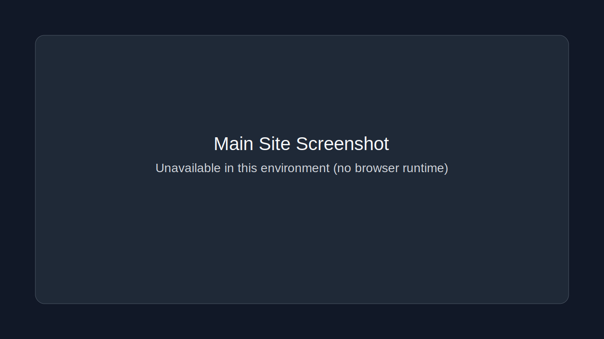
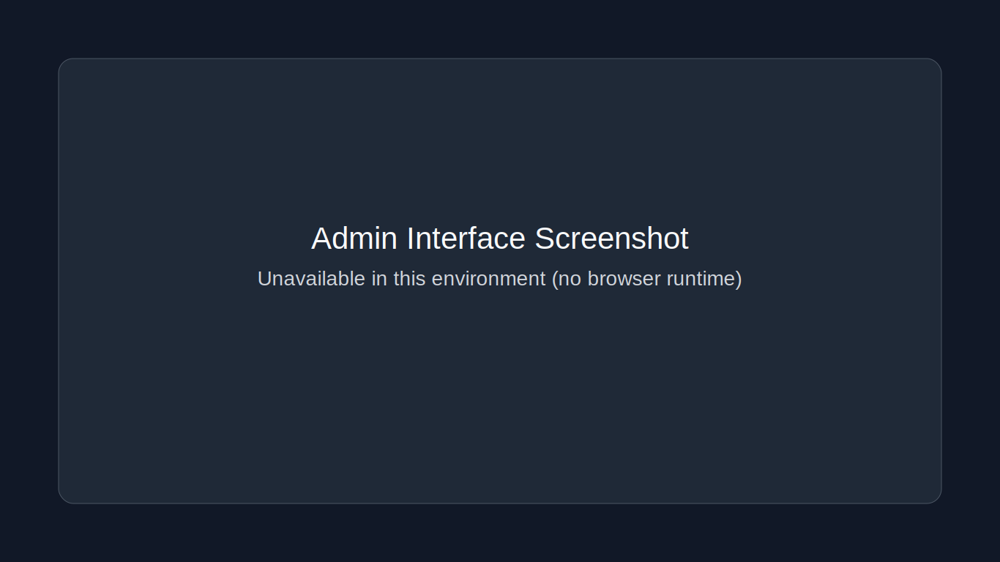

# LensCraft Photography Portfolio

A modern photography portfolio built with **Next.js 16**, **React 19**, **TypeScript**, and **Tailwind CSS v4**.  
It includes a public-facing portfolio experience plus a protected admin dashboard for managing content.

## ✨ New Features

- **Admin Authentication** with JWT cookie sessions.
- **Admin Dashboard** with overview cards and quick actions.
- **Gallery Management** tools for portfolio images.
- **Services Management** to update offerings.
- **Content Management** for editable site sections.
- **API Routes** for auth, gallery, services, content, uploads, and seeding.
- **Animated, Responsive UI** across the public site and admin interface.

## 🖥️ Desktop Screenshots

> Note: The execution environment for this task does not provide a browser runtime, so real desktop captures could not be generated automatically. Placeholder image files are included so paths are ready for replacement with real screenshots.

### Main Site (Desktop)



### Admin Interface (Desktop)



### Additional Captures Prepared

- `docs/screenshots/main-site-2-unavailable.svg`
- `docs/screenshots/admin-interface-2-unavailable.svg`

## 🚀 Getting Started

### Prerequisites

- Node.js 18+
- npm

### Installation

```bash
git clone https://github.com/mrglasswillbreak/photographyPortfolio.git
cd photographyPortfolio
npm install
npm run dev
```

### Build for Production

```bash
npm run build
```

### Start Production Server

```bash
npm run start
```

## 🔐 Admin Setup

Create a local environment file:

```bash
cp .env.example .env.local
```

Set at minimum:

- `ADMIN_USERNAME`
- `ADMIN_PASSWORD`
- `JWT_SECRET`

Then sign in at:

- `/admin/login`

## 📁 Project Structure

```text
app/
├── page.tsx                        # Public homepage
├── admin/
│   ├── login/page.tsx              # Admin login
│   └── dashboard/                  # Protected dashboard pages
└── api/                            # Auth/content/gallery/services routes
```

## 📄 License

MIT
